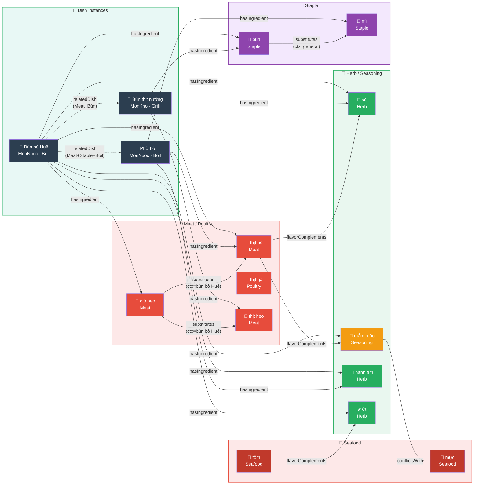
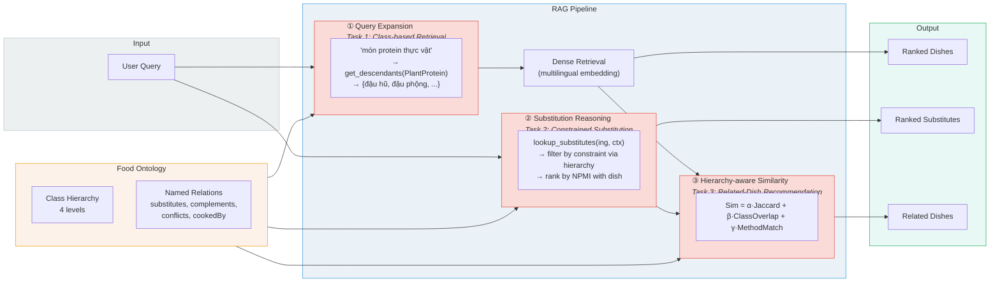

# Figure 1: Ontology Structure — T-box (Schema) and A-box (Instances)

```mermaid
graph TD
    subgraph TBOX["<b>T-box (Schema): Class Hierarchy &amp; Relation Types</b>"]
        direction TB

        Ingredient["<b>Ingredient</b>"]

        Protein["Protein"]
        Produce["Produce"]
        Seasoning["Seasoning"]
        Staple["Staple"]
        DairyEtc["Dairy | Beverage | Sweet | Processed | Other"]

        Ingredient -->|subClassOf| Protein
        Ingredient -->|subClassOf| Produce
        Ingredient -->|subClassOf| Seasoning
        Ingredient -->|subClassOf| Staple
        Ingredient -->|subClassOf| DairyEtc

        AnimalProtein["AnimalProtein"]
        PlantProtein["PlantProtein"]
        Protein -->|subClassOf| AnimalProtein
        Protein -->|subClassOf| PlantProtein

        Seafood["Seafood"]
        Meat["Meat"]
        Poultry["Poultry"]
        Egg["Egg"]
        AnimalProtein -->|subClassOf| Seafood
        AnimalProtein -->|subClassOf| Meat
        AnimalProtein -->|subClassOf| Poultry
        AnimalProtein -->|subClassOf| Egg

        Herb["Herb"]
        Vegetable["Vegetable"]
        Mushroom["Mushroom"]
        Produce -->|subClassOf| Herb
        Produce -->|subClassOf| Vegetable
        Produce -->|subClassOf| Mushroom

        Dish["<b>Dish</b>"]
        ByType["byType: MonNuoc, MonKho, MonXao, ..."]
        ByMethod["byMethod: Boil, Fry, Grill, Steam, ..."]
        Dish -->|classified by| ByType
        Dish -->|classified by| ByMethod

        %% Relation type signatures
        R1["<i>substitutes</i>(ing × ing × ctx)"]
        R2["<i>flavorComplements</i>(ing × ing)"]
        R3["<i>conflictsWith</i>(ing × ing)"]
        R4["<i>cookedBy</i>(dish × method)"]
        R5["<i>hasIngredient</i>(dish × ing)"]
    end

    subgraph ABOX["<b>A-box (Instances): Assertions</b>"]
        direction TB

        %% Ingredient instances
        i1["🥩 thịt bò<br/><i>instanceOf</i> Meat"]
        i2["🐔 thịt gà<br/><i>instanceOf</i> Poultry"]
        i3["🧈 đậu hũ<br/><i>instanceOf</i> PlantProtein"]
        i4["🦐 tôm<br/><i>instanceOf</i> Seafood"]
        i5["🌿 húng quế<br/><i>instanceOf</i> Herb"]

        %% Dish instances
        d1["🍜 Phở bò<br/><i>instanceOf</i> Dish"]
        d2["🍜 Phở gà<br/><i>instanceOf</i> Dish"]

        %% Relation assertions
        i1 ---|"substitutes(ctx=phở)"| i2
        i1 ---|"substitutes(ctx=phở)"| i3
        i1 ---|"flavorComplements"| i5
        d1 ---|"hasIngredient"| i1
        d2 ---|"hasIngredient"| i2
        d1 ---|"cookedBy: Boil"| d1b["  "]
        d2 ---|"cookedBy: Boil"| d2b["  "]
    end

    %% Link A-box to T-box
    i1 -.->|instanceOf| Meat
    i2 -.->|instanceOf| Poultry
    i3 -.->|instanceOf| PlantProtein
    i4 -.->|instanceOf| Seafood
    i5 -.->|instanceOf| Herb

    style TBOX fill:#fdf2e9,stroke:#e67e22,stroke-width:2px
    style ABOX fill:#eaf2f8,stroke:#2980b9,stroke-width:2px
    style Ingredient fill:#2c3e50,color:#fff
    style Dish fill:#2c3e50,color:#fff
    style Protein fill:#e74c3c,color:#fff
    style Produce fill:#27ae60,color:#fff
    style Seasoning fill:#f39c12,color:#fff
    style Staple fill:#8e44ad,color:#fff
    style AnimalProtein fill:#e74c3c,color:#fff
    style PlantProtein fill:#e74c3c,color:#fff
    style Seafood fill:#e74c3c,color:#fff
    style Meat fill:#e74c3c,color:#fff
    style Poultry fill:#e74c3c,color:#fff
    style Egg fill:#e74c3c,color:#fff
    style Herb fill:#27ae60,color:#fff
    style Vegetable fill:#27ae60,color:#fff
    style Mushroom fill:#27ae60,color:#fff
    style DairyEtc fill:#3498db,color:#fff
    style R1 fill:#fff,stroke:#e67e22,stroke-dasharray: 5 5
    style R2 fill:#fff,stroke:#e67e22,stroke-dasharray: 5 5
    style R3 fill:#fff,stroke:#e67e22,stroke-dasharray: 5 5
    style R4 fill:#fff,stroke:#e67e22,stroke-dasharray: 5 5
    style R5 fill:#fff,stroke:#e67e22,stroke-dasharray: 5 5
    style d1b fill:none,stroke:none
    style d2b fill:none,stroke:none
```

---

# Figure 1b: A-box (Instances & Assertions) — Standalone

> Scenario: User hỏi *"Nấu bún bò Huế mà hết giò heo thì thay bằng gì?"*

---

# Figure 2: RAG Pipeline with 3 Ontology Injection Points

